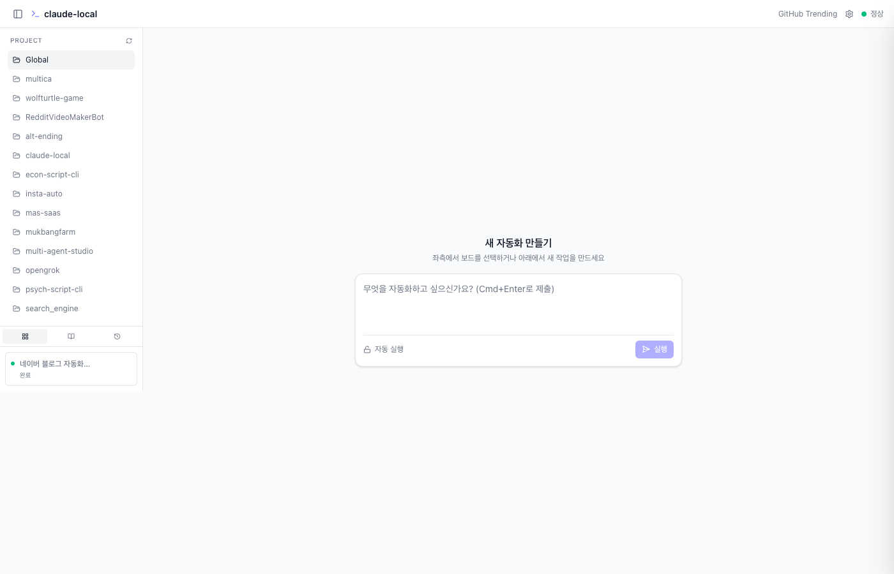
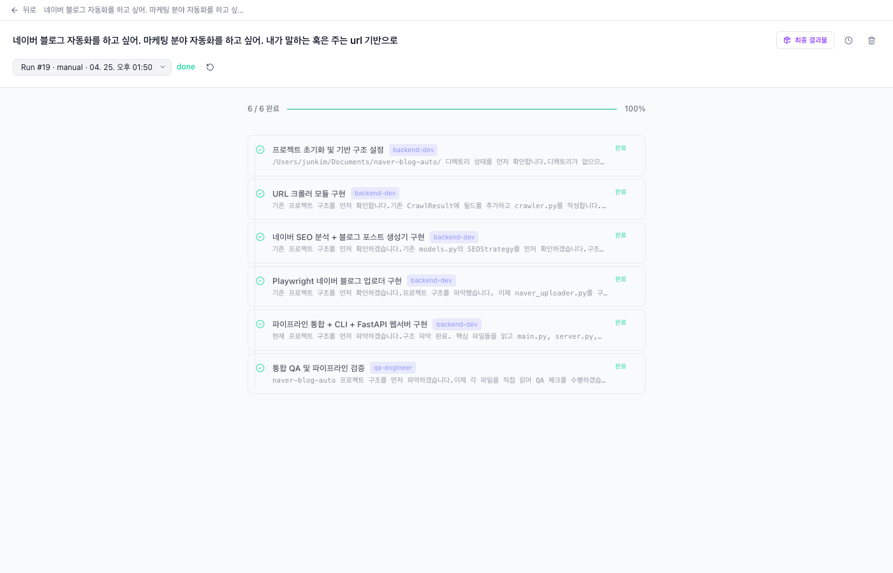
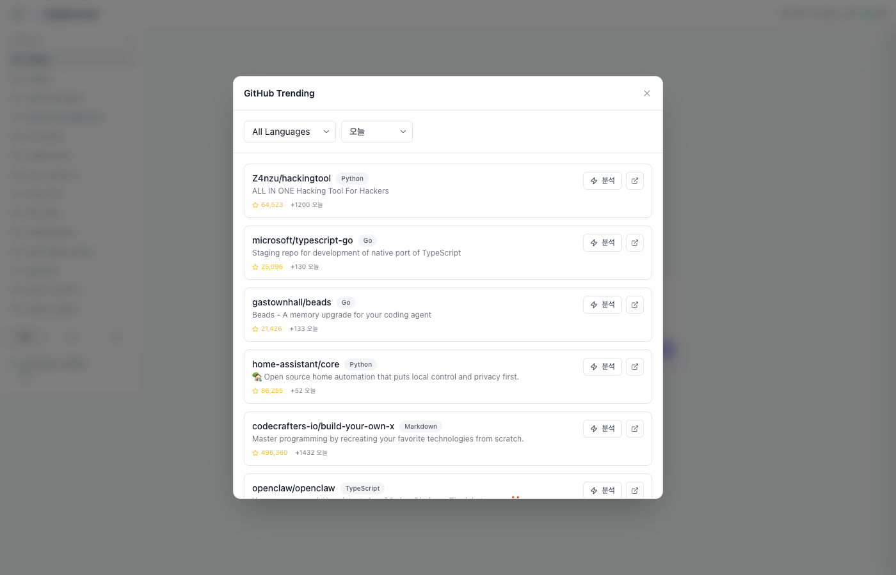

# claudeasy

> **말하면 AI가 개발한다** — Claude Code를 이용한 로컬 멀티에이전트 오케스트레이션 플랫폼

원하는 것을 입력하면, AI가 전문가 팀을 구성하고 태스크를 나눠 실시간으로 개발을 진행합니다. 코드 한 줄 없이도 자동화 스크립트, 웹 앱, 반복 작업 봇까지 만들 수 있습니다.



---

## 어떻게 동작하나요?

```
사용자 입력
    │
    ▼
① 분류 (Classify)
   "매일 뉴스 요약해줘"  →  자동화 보드 (cron 등록)
   "블로그 만들어줘"     →  빌드 보드 (하네스 생성)
   "더 알려줘"          →  질문 카드 (Clarification)
    │
    ▼
② 하네스 생성 (Harness Generation)
   Claude가 에이전트 팀 + 태스크 의존 그래프 설계
   (Backend Dev, Frontend Dev, QA Engineer ...)
    │
    ▼
③ 병렬 실행 (Parallel Execution)
   독립 태스크 → 동시에 실행
   의존 태스크 → 앞 단계 완료 후 실행
   실시간 WebSocket 스트리밍으로 진행 상황 확인
    │
    ▼
④ 결과물 & 스케줄 (Artifact & Schedule)
   서버/스크립트 감지 → 실행 버튼 자동 생성
   "매일 9시" 키워드 → crontab 자동 등록
```

---

## 스크린샷

### 보드 실행 결과 — 6개 카드 전부 완료


### GitHub Trending 분석 — 트렌딩 레포를 내 프로젝트에 적용


---

## 주요 기능

| 기능 | 설명 |
|------|------|
| 🤖 **멀티에이전트 오케스트레이션** | 요청 하나로 전문가 팀 + 태스크 그래프 자동 생성 |
| ⚡ **실시간 스트리밍** | WebSocket으로 카드 출력을 글자 단위로 실시간 표시 |
| 🔗 **의존성 기반 실행** | 사이클 감지, 실패 전파, 독립 태스크 병렬화 |
| 🗓️ **자동화 & 스케줄링** | 자연어("매일 오전 9시") → cron 자동 등록 |
| 📦 **아티팩트 자동 감지** | uvicorn, npm run dev, streamlit, flask 등 자동 인식 → 실행 버튼 |
| 🔒 **민감어 자동 차단** | 비밀번호/API키 질문은 자동 답변 대신 사용자에게 에스컬레이션 |
| 🌐 **GitHub 연동** | OAuth + Trending 레포 분석 + 내 프로젝트 적용 |
| 🔔 **알림** | Telegram / Email 푸시 알림 |
| 📚 **harness-100 라이브러리** | 10개 도메인, 489개 에이전트, 315개 스킬 내장 |

---

## 아키텍처

```
┌──────────────────────────────────────────────────────────┐
│                    Frontend (React 19)                    │
│   사이드바(프로젝트)  │  보드 목록  │  카드 뷰  │  설정    │
│         WebSocket 구독 (보드 / 런 / 카드 단위)            │
└───────────────────────┬──────────────────────────────────┘
                        │ HTTP + WebSocket
┌───────────────────────▼──────────────────────────────────┐
│                  server.py (FastAPI)                      │
│                                                           │
│  POST /api/boards ──► _classify_request()                 │
│                              │                            │
│                   ┌──────────▼──────────┐                │
│                   │   _run_pipeline()   │                │
│                   │   harness.py        │                │
│                   │   generate_harness()│                │
│                   └──────────┬──────────┘                │
│                              │  agents + tasks            │
│                   ┌──────────▼──────────┐                │
│                   │ _run_cards_with_    │                │
│                   │    deps()           │                │
│                   │  (Kahn's sort)      │                │
│                   └──────────┬──────────┘                │
│                              │                            │
│                   ┌──────────▼──────────┐                │
│                   │    run_card()       │◄── Claude CLI   │
│                   │    harness.py       │    subprocess   │
│                   └──────────┬──────────┘                │
│                              │ artifact detected          │
│                   ┌──────────▼──────────┐                │
│                   │  _artifact_procs    │  uvicorn / node │
│                   │  (subprocess dict)  │  python / ...   │
│                   └─────────────────────┘                │
│                                                           │
│  scheduler.py ──► crontab ──► /api/boards/{id}/trigger   │
└───────────────────────┬──────────────────────────────────┘
                        │ SQL
┌───────────────────────▼──────────────────────────────────┐
│                   SQLite (data.db)                        │
│   boards │ runs │ cards │ agents │ feedback │ settings    │
└──────────────────────────────────────────────────────────┘
```

### 핵심 파일

| 파일 | 역할 |
|------|------|
| `server.py` | FastAPI 앱, 50+ API 엔드포인트, WebSocket 핸들러 |
| `harness.py` | 하네스 생성, 카드 실행, 아티팩트 파싱 |
| `db.py` | SQLite 스키마, CRUD, 자동 마이그레이션 |
| `scheduler.py` | crontab 연동, 스케줄 등록/해제 |
| `notifier.py` | Telegram / Email 알림 |
| `github_trending.py` | 트렌딩 레포 스크래핑 + Claude 분석 |
| `web/` | React + TypeScript 프론트엔드 |
| `harness-100/` | 100개 프로덕션 하네스 라이브러리 |

---

## 빠른 시작

### 사전 요구사항

- [Claude Code CLI](https://claude.ai/code) 설치 + 인증 완료 (**필수**)
- Python 3.11+
- Node.js 18+ 또는 [Bun](https://bun.sh)

### 설치

```bash
# 1. 저장소 클론
git clone https://github.com/junsungkim-lab/claudeasy.git
cd claudeasy

# 2. Python 의존성
pip install -r requirements.txt

# 3. 프론트엔드 의존성
cd web && bun install && cd ..

# 4. 환경변수 설정 (선택)
cp .env.example .env
```

### 실행

```bash
# 서버 시작
python3 server.py
```

브라우저에서 [http://localhost:8100](http://localhost:8100) 접속

> 개발 모드(핫 리로드): 별도 터미널에서 `cd web && bun run dev` 실행 후 [http://localhost:5173](http://localhost:5173) 접속

---

## 사용 방법

### 1단계: 원하는 것 입력

중앙 입력창에 자연어로 요청합니다.

```
# 프로젝트 개발
React + FastAPI로 Todo 앱 만들어줘

# 반복 자동화 (cron 자동 등록)
매일 오전 8시에 환율 정보 가져와서 텔레그램으로 보내줘

# 스케줄 자동 감지
30분마다 서버 헬스체크하는 스크립트 만들어줘
```

### 2단계: 에이전트 팀 자동 구성

입력 후 몇 초 안에 Claude가 전문가 팀을 설계하고 태스크 카드를 생성합니다.

```
예시: "네이버 블로그 자동화" 요청 시

  [카드 1] 프로젝트 초기화 및 기반 구조 설정   backend-dev  → 완료
  [카드 2] URL 크롤러 모듈 구현              backend-dev  → 완료
  [카드 3] 네이버 SEO 분석 + 포스트 생성기    backend-dev  → 완료
  [카드 4] Playwright 네이버 블로그 업로더    backend-dev  → 완료
  [카드 5] 파이프라인 통합 + FastAPI 웹서버   backend-dev  → 완료
  [카드 6] 통합 QA 및 파이프라인 검증         qa-engineer  → 완료
```

### 3단계: 실행 모드 선택

| 모드 | 동작 |
|------|------|
| **자동 실행** | 카드가 순서대로 자동 실행 (기본값) |
| **수동 승인** | 각 카드마다 Approve / Reject 선택 후 실행 |

### 4단계: 결과물 실행

"최종 결과물" 탭에서 생성된 서버 또는 스크립트를 바로 실행합니다.

- **서버** → `서버 실행` 버튼 클릭 → 백그라운드 실행 + 포트 링크 자동 생성
- **스크립트** → `실행하기` 버튼
- 환경변수가 필요하면 실행 전에 입력 폼이 자동 표시됩니다

### 5단계: 스케줄 관리 (자동화 보드)

보드 헤더 → 🕐 스케줄 아이콘:

```
지원하는 자연어 표현:
  매일 오전 9시        →  0 9 * * *
  매주 월요일 오전 10시  →  0 10 * * 1
  30분마다             →  */30 * * * *
  매시 정각            →  0 * * * *
```

---

## 프로젝트 컨텍스트 파일

에이전트는 프로젝트 루트의 두 파일을 자동으로 참조합니다.

| 파일 | 용도 |
|------|------|
| `CLAUDE.md` | 프로젝트 개요, 기술 스택, 주의사항 |
| `MEMORY.md` | 작업 이력, 결정 사항, 누적 지식 |

없어도 동작하지만, 있으면 에이전트가 프로젝트를 훨씬 잘 이해합니다.

---

## GitHub Trending 분석

헤더 → `GitHub Trending` 버튼

1. 언어 / 기간 필터로 트렌딩 레포 탐색
2. 원하는 레포의 **분석** 버튼 → shallow clone 후 Claude가 분석
3. **분석 적용하기** → 즉시 개발 보드 생성

> **팁**: 사이드바에서 내 프로젝트를 먼저 선택한 상태에서 분석하면 "이 레포를 내 프로젝트에 어떻게 적용할지" 맞춤 분석을 받을 수 있습니다.

---

## 환경변수

`.env` 파일 (모두 선택 사항):

```bash
# Tavily 실시간 웹 검색 (하네스 생성 컨텍스트 강화)
TAVILY_API_KEY=

# 서버 포트 (기본: 8100)
PORT=8100
```

알림(Telegram / Email) 설정은 UI의 **설정 페이지**에서 입력합니다. DB에 저장되어 재시작 후에도 유지됩니다.

---

## API 엔드포인트

```
POST   /api/boards                        # 보드 생성 (분류 + 하네스)
GET    /api/boards                        # 보드 목록
POST   /api/boards/{id}/runs              # 재실행
DELETE /api/boards/{id}                   # 삭제

POST   /api/cards/{id}/approve            # 카드 승인/거부
POST   /api/cards/{id}/run                # 아티팩트 실행
POST   /api/cards/{id}/stop               # 아티팩트 중지

PUT    /api/boards/{id}/schedule          # 스케줄 등록
POST   /api/boards/{id}/schedule/trigger  # 즉시 실행
DELETE /api/boards/{id}/schedule          # 스케줄 해제

WS     /ws/board/{id}                     # 보드 이벤트 스트림
WS     /ws/run/{run_id}                   # 런 카드 업데이트
WS     /ws/card/{id}                      # 카드 출력 실시간 스트림
```

---

## 기술 스택

**Backend**
- FastAPI + uvicorn (비동기 REST + WebSocket)
- SQLite (로컬 데이터베이스, 자동 마이그레이션)
- Claude Code CLI (AI 실행 엔진)
- crontab (스케줄링)
- httpx, playwright

**Frontend**
- React 19 + TypeScript
- Vite (빌드 도구)
- TanStack React Query (서버 상태)
- Zustand (클라이언트 상태)
- Tailwind CSS 4

---

## 라이선스

MIT
