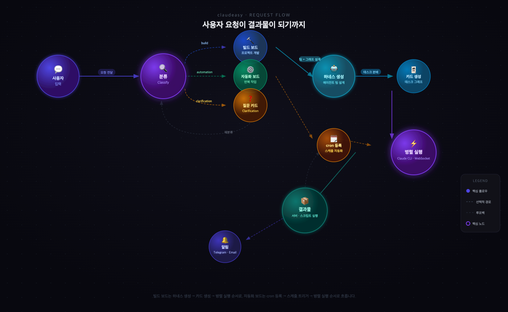
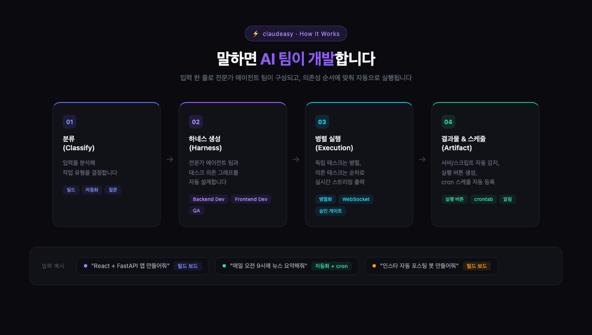
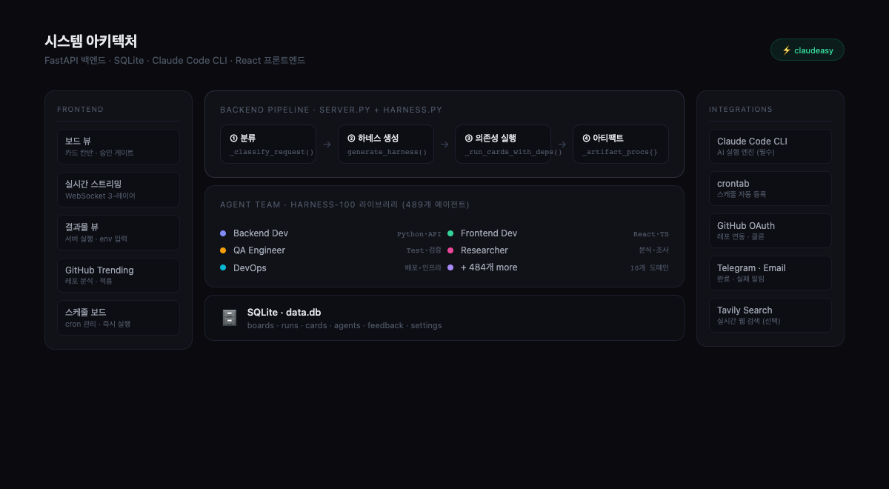

# claudeasy

> **말하면 AI가 개발한다** — Claude Code를 이용한 로컬 멀티에이전트 오케스트레이션 플랫폼

**한국어 | [English](README.en.md)**



원하는 것을 입력하면, AI가 전문가 팀을 구성하고 태스크를 나눠 실시간으로 개발을 진행합니다.  
코드 한 줄 없이도 자동화 스크립트, 웹 앱, 반복 작업 봇까지 만들 수 있습니다.

---

## 실행 흐름



---

## 시스템 아키텍처



---

## 주요 기능

| 기능 | 설명 |
|------|------|
| 🤖 **멀티에이전트 오케스트레이션** | 요청 하나로 전문가 팀 + 태스크 그래프 자동 생성 |
| ⚡ **실시간 스트리밍** | WebSocket으로 카드 출력을 글자 단위로 실시간 표시 |
| 🔗 **의존성 기반 실행** | 사이클 감지, 실패 전파, 독립 태스크 병렬화 |
| 🗓️ **자동화 & 스케줄링** | 자연어("매일 오전 9시") → cron 자동 등록 |
| 📦 **아티팩트 자동 감지** | uvicorn, npm run dev, streamlit, flask 등 자동 인식 → 실행 버튼 |
| 🔍 **아티팩트 3중 검증** | 파싱 정규화 → 저장 게이트 → 실행 실패 가시화 |
| 🛡️ **SDK 자동 차단** | LLM이 Anthropic SDK를 사용해도 자동 제거 + CLI subprocess로 교체 |
| 📋 **발행 대기 큐** | 블로그/SNS 자동화 보드에 주제·URL을 쌓아두고 순서대로 발행 |
| 🔒 **민감어 자동 차단** | 비밀번호/API키 질문은 자동 답변 대신 사용자에게 에스컬레이션 |
| 🌐 **GitHub 연동** | OAuth + Trending 레포 분석 + 내 프로젝트 적용 |
| 🔔 **알림** | Telegram / Email 푸시 알림 |
| 📚 **harness-100 라이브러리** | 10개 도메인, 489개 에이전트, 315개 스킬 내장 |

---

## 빠른 시작

### 사전 요구사항

- [Claude Code CLI](https://claude.ai/code) 설치 + 인증 완료 (**필수**)
- Python 3.9+
- Node.js 18+ 또는 [Bun](https://bun.sh)

### 설치

```bash
# 1. 저장소 클론
git clone https://github.com/junsungkim-lab/claudeasy.git
cd claudeasy

# 2. Python 의존성
pip install -r requirements.txt

# 3. 프론트엔드 의존성
cd web && bun install && cd ..

# 4. 환경변수 설정 (선택)
cp .env.example .env
```

### 실행

```bash
python3 server.py
```

브라우저에서 [http://localhost:8100](http://localhost:8100) 접속

> **개발 모드** (핫 리로드): 별도 터미널에서 `cd web && bun run dev` 실행 후 [http://localhost:5173](http://localhost:5173) 접속

---

## 사용 방법

### 1단계: 원하는 것 입력

중앙 입력창에 자연어로 요청합니다.

```
# 프로젝트 개발
React + FastAPI로 Todo 앱 만들어줘

# 반복 자동화 (cron 자동 등록)
매일 오전 8시에 환율 정보 가져와서 텔레그램으로 보내줘

# 콘텐츠 자동화 (발행 큐 자동 생성)
네이버 블로그 SEO 포스팅 자동화해줘. 매일 오전 10시에 발행.
```

### 2단계: 에이전트 팀 자동 구성

입력 후 몇 초 안에 Claude가 전문가 팀을 설계하고 태스크 카드를 생성합니다.

```
예시: "네이버 블로그 자동화" 요청 시

  [카드 1] 프로젝트 초기화 및 기반 구조 설정   backend-dev  → 완료
  [카드 2] URL 크롤러 모듈 구현              backend-dev  → 완료
  [카드 3] SEO 분석 + 포스트 생성기           backend-dev  → 완료
  [카드 4] Playwright 네이버 블로그 업로더    backend-dev  → 완료
  [카드 5] 파이프라인 통합 + 스케줄 연동       backend-dev  → 완료
  [카드 6] 통합 QA 및 파이프라인 검증         qa-engineer  → 완료
```

### 3단계: 실행 모드 선택

| 모드 | 동작 |
|------|------|
| **자동 실행** | 카드가 순서대로 자동 실행 (기본값) |
| **수동 승인** | 각 카드마다 Approve / Reject 선택 후 실행 |

### 4단계: 결과물 실행

"최종 결과물" 탭에서 생성된 서버 또는 스크립트를 바로 실행합니다.

- **서버** → `서버 실행` 버튼 클릭 → 백그라운드 실행 + 포트 링크 자동 생성
- **스크립트** → `실행하기` 버튼
- 실행 실패 시 5초 내 stderr 로그를 빨간 박스로 UI에 즉시 표시
- 환경변수가 필요하면 실행 전에 입력 폼이 자동 표시됩니다

### 5단계: 발행 대기 큐 관리 (콘텐츠 자동화)

블로그·SNS 등 반복 콘텐츠 자동화 보드는 "최종 결과물" 탭 하단에 **발행 대기 큐** 패널이 자동으로 표시됩니다.

- 주제 텍스트 또는 `https://` URL을 입력해 큐에 추가
- 추가 지시사항(톤, 타겟, 강조점 등) 별도 입력 가능
- 등록된 항목은 순서대로 매일 1개씩 자동 발행
- 최근 5개 발행 이력 확인 가능

```
발행 큐 예시:
  1. 2026년 봄 건강 식단 트렌드          →  오늘 발행 예정
  2. https://example.com/product        →  내일 발행 예정
  3. 다이어트 보조제 비교 리뷰            →  모레 발행 예정
```

### 6단계: 스케줄 관리 (자동화 보드)

보드 헤더 → 🕐 스케줄 아이콘에서 설정합니다.

```
지원하는 자연어 표현:
  매일 오전 9시         →  0 9 * * *
  매주 월요일 오전 10시  →  0 10 * * 1
  30분마다              →  */30 * * * *
  매시 정각             →  0 * * * *
```

---

## 아티팩트 3중 검증 시스템

LLM이 생성한 실행 메타데이터(cwd, 실행 명령, 타입)를 3단계로 검증해 잘못된 설정이 고객에게 도달하지 않도록 차단합니다.

```
Layer 1: 파싱 정규화 (harness.py)
  - cwd가 project 외부이면 project_path로 자동 보정
  - type이 서버 키워드 없는데 server이면 script로 강등
  - 인수 값 누락 의심 플래그(--flag) 경고

Layer 2: 저장 게이트 (server.py)
  - run_command 비어있으면 저장 거부 → 실행 버튼 미노출
  - cwd 디렉터리 부재 시 저장 거부
  - 스크립트 파일 부재 시 저장 거부
  - 경고 항목은 카드 하단 마커 + UI 배지로 표시

Layer 3: 실행 실패 가시화 (server.py)
  - 프로세스 기동 후 5초 내 비정상 종료 감지
  - stderr tail(최대 2000자)을 카드 하단 빨간 박스에 즉시 표시
  - WebSocket artifact_failed 이벤트로 실시간 알림
```

---

## Anthropic SDK 자동 차단

이 플랫폼은 Claude Code CLI(`claude -p`)로만 AI를 호출합니다. `pip install anthropic`은 설치되어 있지 않으며, LLM이 실수로 SDK 코드를 작성해도 자동으로 교체합니다.

**자동 교체 동작 (`_sanitize_sdk_usage`)**:

| 대상 | 처리 |
|------|------|
| `import anthropic` / `from anthropic import ...` | 라인 제거 + Claude CLI subprocess snippet 삽입 |
| `requirements.txt`의 `anthropic` 항목 | 자동 제거 |
| `.env` / `.env.example`의 `ANTHROPIC_API_KEY` | 자동 제거 |

카드 완료 시마다 프로젝트 전체 `.py` 파일을 자동 스캔하며, 교체된 파일 목록은 카드 경고 마커로 표시됩니다.

---

## 프로젝트 컨텍스트 파일

에이전트는 프로젝트 루트의 두 파일을 자동으로 참조합니다.

| 파일 | 용도 |
|------|------|
| `CLAUDE.md` | 프로젝트 개요, 기술 스택, 주의사항 |
| `MEMORY.md` | 작업 이력, 결정 사항, 누적 지식 |

없어도 동작하지만, 있으면 에이전트가 프로젝트를 훨씬 잘 이해합니다.

---

## GitHub Trending 분석

헤더 → `GitHub Trending` 버튼

1. 언어 / 기간 필터로 트렌딩 레포 탐색
2. 원하는 레포의 **분석** 버튼 → shallow clone 후 Claude가 분석
3. **분석 적용하기** → 즉시 개발 보드 생성

> **팁**: 사이드바에서 내 프로젝트를 먼저 선택한 상태에서 분석하면 "이 레포를 내 프로젝트에 어떻게 적용할지" 맞춤 분석을 받을 수 있습니다.

---

## 환경변수

`.env` 파일 (모두 선택 사항):

```bash
# Tavily 실시간 웹 검색 (하네스 생성 컨텍스트 강화)
TAVILY_API_KEY=

# 서버 포트 (기본: 8100)
PORT=8100
```

> **Anthropic API Key 불필요** — Claude Code CLI가 이미 인증되어 있습니다.

알림(Telegram / Email) 설정은 UI의 **설정 페이지**에서 입력합니다.

---

## 핵심 파일

| 파일 | 역할 |
|------|------|
| `server.py` | FastAPI 앱, 50+ API 엔드포인트, WebSocket 핸들러 |
| `harness.py` | 하네스 생성, 카드 실행, 아티팩트 파싱·정규화·SDK 차단 |
| `db.py` | SQLite 스키마, CRUD, 자동 마이그레이션 |
| `scheduler.py` | crontab 연동, 스케줄 등록/해제 |
| `notifier.py` | Telegram / Email 알림 |
| `github_trending.py` | 트렌딩 레포 스크래핑 + Claude 분석 |
| `web/` | React 19 + TypeScript 프론트엔드 |
| `harness-100/` | 100개 프로덕션 하네스 라이브러리 |

---

## 스크린샷

<table>
<tr>
<td></td>
<td></td>
</tr>
<tr>
<td align="center"><b>메인 화면</b> — 프로젝트 목록 + 요청 입력</td>
<td align="center"><b>보드 뷰</b> — 6개 카드 전부 완료</td>
</tr>
<tr>
<td colspan="2"></td>
</tr>
<tr>
<td colspan="2" align="center"><b>GitHub Trending</b> — 트렌딩 레포 분석 + 내 프로젝트 적용</td>
</tr>
</table>

---

## 라이선스

MIT
